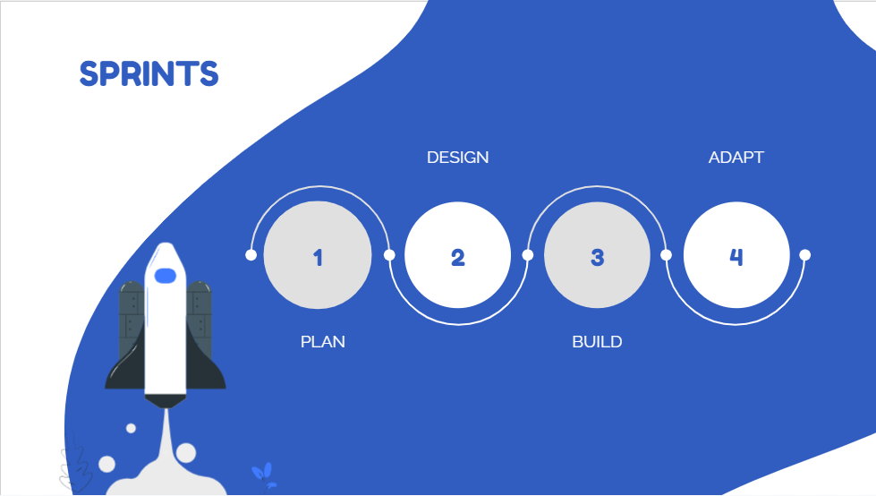
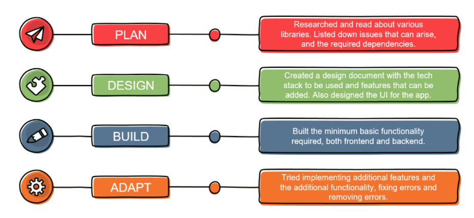
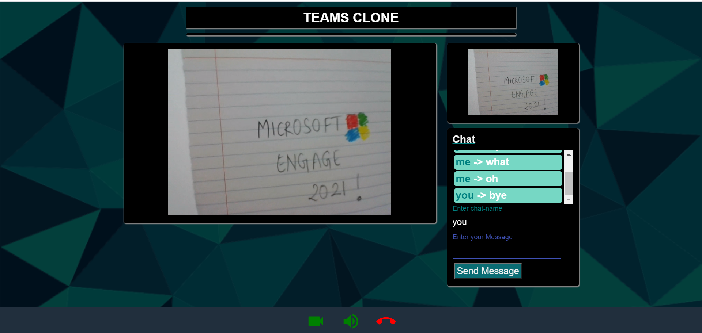

# Engage_2021 

## Description

A web-app that lets users connect and communicate in real-time, sharing their video and audio. All it requires is to share a link to the other person, and they can enjoy a video call. The app is built using WebRTC, implemented by peerJS and socket.io is used for real time communication. The server is written in express and frontend uses ReactJS.

## Sprints

## Documentation

[Link to design doc](https://docs.google.com/document/d/1UaCvR_9u_36I8OXF9Ece1V8L8c807iqHlo3d3E2qsdI/edit?usp=sharing)

[Link to presentation](https://docs.google.com/presentation/d/12O3CUv0XmOQnmYw16do7x_JQgMlgonJqgCcNqc2aZJM/edit?usp=sharing)

## Features Planned to be implemented

- Video and Audio calling for 2 users
- Option to mute and unmute
- Option to on and off video stream
- Chat application for the 2 users
- Screen-sharing
- Screen Recording option
- Expand the app for more than 2 users per call

## Features Implemented

- Video and Audio calling for 2 users
- Option to mute and unmute
- Option to on and off video stream
- Chat application for the 2 users during the call

## How to use

- Go to [Link](https://teams-engage-2021.netlify.app/)
- Allow the app to access microphone and camera (Mandatory)
- Click on Generate Link option and send the copied code to the user2 you want to call
- User2 should paste the code in the "Copy ID" placeholder, add a name to call-with (optional), and click on call option.
- If it shows "Callee doesn't exist", that means the code doesn't exist or is outdated, get a new code.
- Otherwise, wait till the other person accepts the call.

## Snapshot

## Seting Up The App (On local system)

- Clone this repository ("git clone repo-link")
- Run "npm install"
- To run the server run : "node index.js"
- To run the frontend: do "cd frontend" and then run "npm start"
